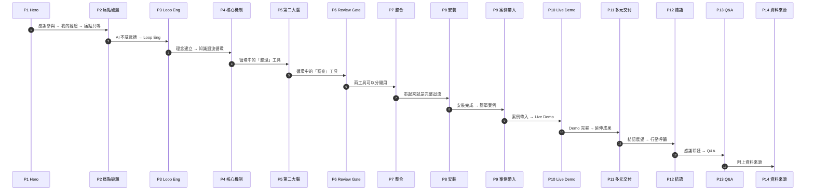
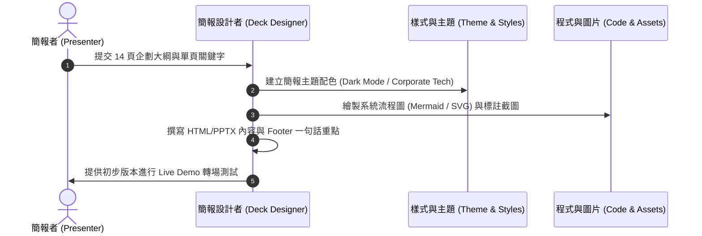

# Plannotator × Obsidian — 知識迴流系統報告 簡報企劃說明文件

## 0. 版本 & 建立日期
- **文件版本 (Version)**：v1.0
- **建立日期 (Date)**：2026-08-08
- **發表場合 (Context)**：系統架構課分享會
- **簡報者與單位 (Presenter & Unit)**：數位創新部/系統架構課 (DIN / AAS)

---

## 1. 背景與動機 (Background & Motivation)

在現今生成式人工智慧 (Generative AI) 輔助軟體開發與架構設計的浪潮中，架構師與工程同仁普遍面臨以下兩大核心困境：
1. **控制力缺失與溝通瓶頸**：向 AI 提問或要求進行系統規劃時，AI 產出的規劃草案常有局部瑕疵或偏離期望。使用者難以一次性精準反饋所有修改意見，導致陷入無窮無盡的 Prompt 修正循環。
2. **資訊碎片化與知識流失**：在與 AI 頻繁互動的過程中，許多寶貴的思考脈絡、研究文獻與對話決策散落於各個對話視窗與暫存檔中，無法有效沉澱為可重複利用的組織知識資產。

本簡報旨在向 ITD 資訊本部所有同仁們，介紹一套結合 **Plannotator** (審查閘門工具 Review Gate Tool) 與 **Obsidian** (第二大腦知識管理工具 Second Brain Knowledge Management Tool) 的「**知識迴流系統 (Knowledge Reflow System)**」，實現「餵養 → 提問 → 產出 → 沉澱 → 再餵養」的極致知識閉環。

---

## 2. 解決方案與效益評估 (Solution & Value Proposition)

### 2.1 解決方案核心架構
- **Plannotator 作為審查閘門 (Review Gate)**：引進「人機協同 (Human-in-the-Loop, HITL)」機制。在 AI 產出規劃或程式碼前，提供直觀的視覺化審查與批註介面，控制生成品質。
- **Obsidian 作為第二大腦 (Second Brain)**：利用雙向連結 (Bi-directional Linking) 與關聯圖譜 (Graph View)，將通過審查的資訊沉澱為結構化的知識網路。
- **知識迴流飛輪 (Knowledge Reflow Flywheel)**：將 Obsidian 沉澱的歷史脈絡作為下一階段 AI 的餵養上下文 (Context Feeding)，形成越用越聰明的正向循環。

### 2.2 實際使用經驗 (Practical Experience)

沒有精確的量化數據，但就個人實際使用經驗分享：

- **溝通次數大幅減少**：過往需要 10 次以上的溝通，使用 Plannotator 審查後，通常 1 到 2 次就結束。即使太過複雜的問題可能還是會比較多輪，但還是比沒有使用之前好很多。
- **知識重用更方便**：自己學習、與他人分享、與 AI 討論、產生報告時，都能直接從知識庫出發，不用從零開始。
- **交付物多樣化**：同一份結構化 Wiki 可轉譯為簡報 (PPT)、技術文件 (Wiki) 或營運報告，實現「一次撰寫，多處輸出 (Write Once, Render Anywhere)」。

---

## 3. 成果產出面向 (Outcome Perspectives)

這套工具在不同工作場景中，可以產生什麼樣的成果：

| 面向 (Perspective) | 場景說明 (Scenario) | 成果產出 (Deliverables) |
| :--- | :--- | :--- |
| **系統開發** | 新專案啟動、架構評估、技術方案研究 | 架構計畫書、技術評估報告、需求研究文件、決策紀錄 |
| **日常維運** | 問題排查、運維知識累積、經驗傳承 | 故障排除手冊、運維 SOP、團隊 Wiki、新人 onboarding 文件 |
| **研究與知識領域** | 新技術學習、跨領域知識探索、個人成長 | 研究筆記、技術比較分析、學習路徑圖、分享簡報 |

---

## 4. 功能設計 (Functional Design & Deck Architecture)

本章針對 14 頁簡報結構進行深度細化，回答結構邏輯鏈、單頁一句話重點、轉場語與關鍵議題。

### 4.1 14 頁簡報結構與單頁設計 (Slide-by-Slide Design)

#### Page 1: Hero — 首頁標題
- **簡報標題**：Plannotator × Obsidian — 知識迴流系統報告
- **副標題 / 資訊**：數位創新部/系統架構課 | 2026-08-08
- **一句話重點**：把 AI 的雜訊變成可追溯、可再用的組織資產。
- **轉場語**：感謝各位同仁參與今天的系統架構分享會。在日常開發與架構設計中，相信大家已經廣泛使用 AI 工具，但大家是否也常遇到一些讓人困擾的瓶頸？讓我從我自己的經驗開始談起。

#### Page 2: 破題：你有沒有遇過這些情況？ (Personal Pain Points)
- **內容重點**：
  1. **溝通無奈**：和 AI 討論架構，出來的規劃有許多細節不符合預期，但很難一次性把修正意見講清楚。
  2. **資訊遺失**：讀了很多資料、做了很多 Prompt 測試，但寶貴的對話細節散落各處，過一段時間就找不回來。
- **一句話重點**：Prompt 不穩定，知識卻在流失。
- **轉場語**：為了解決這種困擾，技術圈最近有一個非常熱門的思想轉變，那就是——Loop Engineering。

#### Page 3: 觀念革命：Loop Engineering 白話解析
- **內容重點**：白話解釋 Loop Engineering 爆紅的原因。過去大家追求「單次 Prompt 一下到位 (Single-shot Prompting)」，但複雜架構不可能一蹴可幾；現代 AI 工程強調「打造快速且微小的閉環 (Small Feedback Loops)」，透過 Human-in-the-Loop 隨時調整方向。
- **一句話重點**：用短迭代讓 AI 逐步達成可驗證的計畫。
- **轉場語**：有了 Loop Engineering 的指導思想後，我們該如何在日常架構工作中落實這個迴圈？

#### Page 4: 核心機制：知識迴流循環 (Knowledge Reflow Cycle)
- **內容重點**：展示知識迴流的循環流程圖：「餵養 (Feed) → 整理 (Organize) → 使用 (Use) → 沉澱 (Settle) → 再餵養」。強調這是一個閉環迴流，工具只是輔助，機制才是核心。
- **一句話重點**：審查→沉澱→再餵養，讓知識越用越聰明。
- **轉場語**：在這個循環中，有兩個關鍵工具分別負責不同的環節。首先，我們來看負責「整理」與「沉澱」的第二大腦——Obsidian。

#### Page 5: 第二大腦：Obsidian (Second Brain)
- **內容重點**：介紹 Obsidian 的核心概念：
  - 來自 Andrej Karpathy 的 LLM Wiki 理念 + Google OKF（Open Knowledge Framework）精神
  - 資料流：raw/（原始資料，唯讀）→ wiki ingest（AI 整理）→ wiki/（結構化知識）
  - Graph View 的四個價值：發現關聯、知識缺口、孤兒頁、決策樞紐
  - 重點：不需要向量資料庫，簡單的 wiki + index 就夠用；Markdown 才是可長期保存、可被 AI 讀寫的知識格式
- **一句話重點**：自帶關聯圖譜的智慧型數位檔案櫃——你只需要擔任 Human in the Loop 中的 Human。
- **比喻**：Obsidian ≈ 自帶 Graph View 的智慧型數位檔案櫃
- **轉場語**：Obsidian 幫我們把知識整理好、沉澱好。但當 AI 產出的結果不盡理想時，我們需要一個「審查關卡」——這就是 Plannotator。

#### Page 6: 審查閘門：Plannotator (Review Gate)
- **內容重點**：
  - 核心概念：不只是 coding tool，所有 AI 產出（Plan、Code、Markdown、HTML、URL）都可以納入審查
  - Review Gate 流程：AI 產生 Plan → Plannotator 審查 UI → 核准/駁回（含批註回饋）
  - 支援的檔案類型：Plan Review、Code Review、Markdown/HTML 標註、標註最後一則回覆
  - 重點：**Plannotator 可以單獨使用**——不一定要搭配 Obsidian。任何你跟 AI 討論時，想要一次性表達所有反饋，都很適合用 Plannotator
  - 個人經驗：過往需要 10 次以上的溝通，通常 1 到 2 次就結束
- **一句話重點**：AI 說「我打算這樣做」的時候，讓你在執行前先審查它的計畫——就像 Code Review 審查 Pull Request 一樣。
- **比喻**：Plannotator ≈ 系統開發中的 PR 審查門檻（在發佈前先做 Inspection）
- **轉場語**：這兩個工具可以分開用，也可以串在一起用。接下來看看它們如何無縫整合。

#### Page 7: 整合實踐：Plannotator × Obsidian (Integration)
- **內容重點**：
  - Plannotator 內建 Obsidian Integration：Settings → Obsidian → ON
  - 實際操作流程：核准計畫 → Options → Save to Obsidian → raw/plannotator/*.md（帶 frontmatter）
  - 這是知識閉環迴流的關鍵接合點：審查完畢 → 一鍵存入 → AI 整理到 Wiki → 未來研究從 Wiki 出發
  - 再次強調：兩套工具不一定要擺在一起用，但串起來就是完整的知識迴流
- **一句話重點**：審查一次，沉澱永久——無縫將純淨知識寫入第二大腦。
- **轉場語**：了解了工具與整合後，大家一定想知道：在企業環境中如何安裝與落地？

#### Page 8: 安裝與落地：企業環境部署 (Setup & Governance)
- **內容重點**：條理化呈現安裝流程。包含 Skill 擴充安裝、3 步手動設定與資安合規政策。加大字體、精簡重點。
- **一句話重點**：輕量化配置、合規守護，3 步驟即可完成團隊級別的環境部署。
- **轉場語**：百聞不如一見，接下來我們用一個實際案例，帶大家走一遍完整的端到端流轉！
- **⚠️ 資安提醒**：企業內部敏感資料未經脫敏不得直接輸入公有雲 AI 模型。

#### Page 9: 示範案例：情境導入 (Case Study Setup)
- **內容重點**：介紹本次示範情境。題目建議選擇**較簡單、一個小時內可 demo 完畢**的主題，例如：
  - 「評估一項新工具／技術方案」（如：比較幾款 AI coding tools）
  - 「一份研究報告的產生過程」（從提問到產出到審查到存入知識庫）
  - 說明我們將如何從需求提問、AI 產出、Plannotator 審查標註，到最終存入 Obsidian
- **一句話重點**：10 分鐘真實情境示範：帶你親眼見證知識迴流的端到端閉環流轉。
- **轉場語**：說得再多，不如直接看畫面！現在就讓我們切換到實機畫面進行展示。
- **⚠️ Demo 備案**：以預錄 90 秒影片為主，現場短現示為輔。避免現場卡住破壞節奏。

#### Page 10: 🎬 實機演示 (Live Demo)
- **內容重點**：簡單、具視覺衝擊力的轉場頁面。「現在實際操作 (Hands-on Showcase)」
- **一句話重點**：眼見為憑：從需求評估、計畫審查到無縫沉澱的 Live 人機協同實況。
- **轉場語**：（展示完畢後）大家可以看到每一個步驟都被完整記錄了。接下來看看，當這些知識沉澱後，可以延伸出什麼成果。

#### Page 11: 從 Wiki 到多種成果 (From Knowledge to Deliverables)
- **內容重點**：強調「同一份知識 (Single Source of Truth)」，可以輸出多種成果：
  - PPT / 簡報 → 給主管與分享會聽眾
  - Wiki / Azure DevOps Server Wiki → 給 ITD 團隊
  - 其他：Dapps、SharePoint、個人報告（Word / PDF）
  - 核心概念：Obsidian Wiki 是知識整理與維護的作業工廠；PPT 與 Wiki 是面向不同受眾的成品
- **一句話重點**：一次撰寫，多處輸出——讓同一份 Wiki 資產彈性轉譯為簡報、文件與 SOP。
- **轉場語**：最後，讓我們從更高的層面，重新審視這套工作方式帶給我們的價值。

#### Page 12: 結語與展望 (Closing)
- **內容重點**：
  - 補充完整視角：需求 → 規劃 → 審查 → 執行 → 知識沉澱 → 報告 → 組織傳承
  - 三句核心理念：規格先於程式碼、知識先於工具、流程先於自動化
  - 行動呼籲：明天開始的一個行動——下一次和 AI 討論前，先問「你打算怎麼回答？」
  - 強調：工具可以用別的，流程可以不一樣，重要的是找到適合你的方式
- **一句話重點**：工具會變，方法永續傳承——找到適合你自己的方式。
- **轉場語**：感謝大家的聆聽！現在進入問答環節，歡迎大家提出交流。

#### Page 13: Q&A
- **內容重點**：Q&A | 聯絡資訊
- **一句話重點**：歡迎提問與交流。

#### Page 14: 資料來源 (References)
- **內容重點**：列出本簡報引用的參考資料來源
- 說明：Plannotator 與 Obsidian 的官方文件、Karpathy LLM Wiki 概念、Google OKF 框架等

---

### 4.2 核心問題評估與解答 (Answers to User's 5 Questions)

1. **結構邏輯鏈是否通順？有無調整建議？**
   - **調整後的邏輯鏈**：痛點 → Loop Eng 理念 → 核心機制（迴流循環）→ 第二大腦（Obsidian）→ 審查閘門（Plannotator）→ 兩者整合 → 安裝 → 簡單案例 → Demo → 多元交付 → 結語 → Q&A → 資料來源
   - **關鍵調整**：
     - 先講 Obsidian（整理與沉澱），再講 Plannotator（審查與控制），符合知識迴流的自然順序
     - 強調兩套工具可以分開用，不一定要擺在一起
     - Demo 題目改為較簡單的主題，確保一個小時內可完成
     - 新增獨立的「資料來源」頁面

2. **每一頁的一句話重點？**
   - 已於 4.1 章節中逐頁標明（文字精鍊、具衝擊力，適合放在簡報頁面底部標語區 Footer Banner）。

3. **頁與頁之間的轉場語建議？**
   - 已於 4.1 章節中提供完整的高張力口語化腳本，確保簡報者在現場表達流暢自然。

4. **有沒有漏掉的重要觀點？**
   - **品質治理 (Quality Governance)**：主管特別關心「如何防止 AI 幻覺 (Hallucination) 污染企業知識庫」。Plannotator 的 Review Gate 正是提供品質治理的槓桿。
   - **知識可追溯性 (Traceability)**：當系統未來出問題時，能否追溯當時是根據哪一份 raw/ 檔案做出的設計決策。
   - **資產化價值 (Asset Scaling)**：強調這不是「個人省時間」的小小工具，而是「組織知識傳承」的企業級戰略。

5. **Loop Engineering 放在第 3 頁合理嗎？**
   - **非常合理，且位置最佳！**
   - 理由：在第 2 頁聽眾剛被痛點打中（Prompt 難以控制、資訊散落）時，內心會渴望得到理念上的解釋。第 3 頁及時提出「Loop Engineering (迴圈工程)」，正好白話說明技術圈如何從單次 Prompt 轉向 HITL 迴圈，為後續的「知識迴流系統」提供了堅實的理論基礎。

> **你的理解是正確的：** Loop Engineering 的核心就是在讓 AI 真的開始做事之前，先讓它說清楚「它打算怎麼做」。把需求講清楚後，讓 AI 在每一個細節知道我們要怎麼做，再交給它去產生結果，然後以此循環——這就是 Human-in-the-Loop 的具體實踐。

---

## 5. 實作流程 (Implementation Workflow)

若要將此企劃轉化為 HTML 或 PPTX 簡報成品，建議採取以下 5 步實作流程：

1. **主題與色彩系統設定 (Theme Setup)**：選用高對比深色科技風 (Dark Mode / Slate Blue)，代表專業與架構深遠感。
2. **流程圖與視覺元件繪製 (Visual Rendering)**：
   - 第 4 頁：使用 3 階金字塔/閉環滾動動畫呈現知識迴流。
   - 第 5 頁：畫出清晰的 Plannotator Review Gate 雙向引線。
   - 第 11 頁：繪製 Graph View 節點圖（微小連結湧現大知識）。
3. **文字版型優化 (Typographic Hierarchy)**：
   - 限制每頁文字數量，強調 1 段大標題 + 3 個亮點卡片 + 底部「一句話重點」。
   - P7 (Setup) 與 P10 (Evidence Capture) 採用對齊型表格或 Step Card，避免內文字體過小。
4. **演示轉場機制設計 (Transition Mechanisms)**：P9 Demo 轉場頁採用全黑底高亮圖示，方便演示時順暢切換螢幕。
5. **演練與時間掌控 (Rehearsal)**：總時間控制在 25-30 分鐘（簡報 15 分鐘 + Live Demo 8 分鐘 + Q&A 5 分鐘）。

---

## 6. 注意事項 (Precautions & Best Practices)

1. **避免過度沉溺於工具細節**：
   - 聽眾為主管與架構師，重點應放在「**解決什麼問題、資訊如何流轉、如何控管品質**」，而非 Plannotator 或 Obsidian 的按鈕設定細節。
2. **排版視線引導 (Visual Focus)**：
   - 第 7 頁 (Setup) 與第 10 頁 (Evidence Capture) 內容較為紮實，嚴禁將大段文字直接複製貼上。必須拆解為 Step 1-2-3 數字圖卡。
3. **Demo 備案 (Backup Plan)**：
   - Live Demo 具有現場不確定性，P9 轉場後若網路或環境有狀況，必須預先錄製 30 秒的操作 GIF 或影片備用。

---

## 7. 總結 (Summary)

「Plannotator × Obsidian — 知識迴流系統」代表了現代架構師在 AI 時代下的全新工作模式。透過將控制力鎖在 Plannotator 的 Review Gate，並將沉澱資產注入 Obsidian 第二大腦，我們不僅解決了個人與 AI 溝通的痛點，更將個體智慧轉化為組織資產。

本報告設計之 14 頁簡報邏輯順暢、張力十足，透過精準的破題、觀念引導與動態展示，定能獲得與會同仁的高度共鳴與認同。

---

## 8. ITD 工程類比對照表 (Engineering Analogies for ITD)

| 工具/概念 | ITD 熟悉的類比 | 說明 |
| :--- | :--- | :--- |
| **Plannotator** | Pull Request (PR) 審查 | 在發佈前先做 Inspection，不是 coding tool 才能用 |
| **Obsidian** | 自帶關聯圖譜的智慧型數位檔案櫃 | Markdown 就是檔案，Graph View 就是索引 |
| **Loop Engineering** | 閉環控制 (Closed-loop Control) | 不是一次到位，而是逐步收斂 |
| **raw/ 唯讀** | 版本控制的 immutable commit | 原始資料不修改，確保可追溯 |
| **知識迴流** | CI/CD 的 feedback loop | 每次執行都在為下一次加值 |

---

## 9. 資料參考來源 (References)

1. **Obsidian 官方網站與知識管理理念**: [https://obsidian.md/](https://obsidian.md/)
2. **Andrej Karpathy 關於 LLM & Personal Knowledge Management 的論述**: [https://karpathy.ai/](https://karpathy.ai/)
3. **Human-in-the-Loop (HITL) 系統設計規範與實踐**: [https://en.wikipedia.org/wiki/Human-in-the-loop](https://en.wikipedia.org/wiki/Human-in-the-loop)
4. **Google Open Knowledge Framework (OKF) 指南**: [https://research.google/](https://research.google/)
5. **Prompt Engineering vs Loop Engineering 技術變革討論**: [https://arxiv.org/](https://arxiv.org/)
