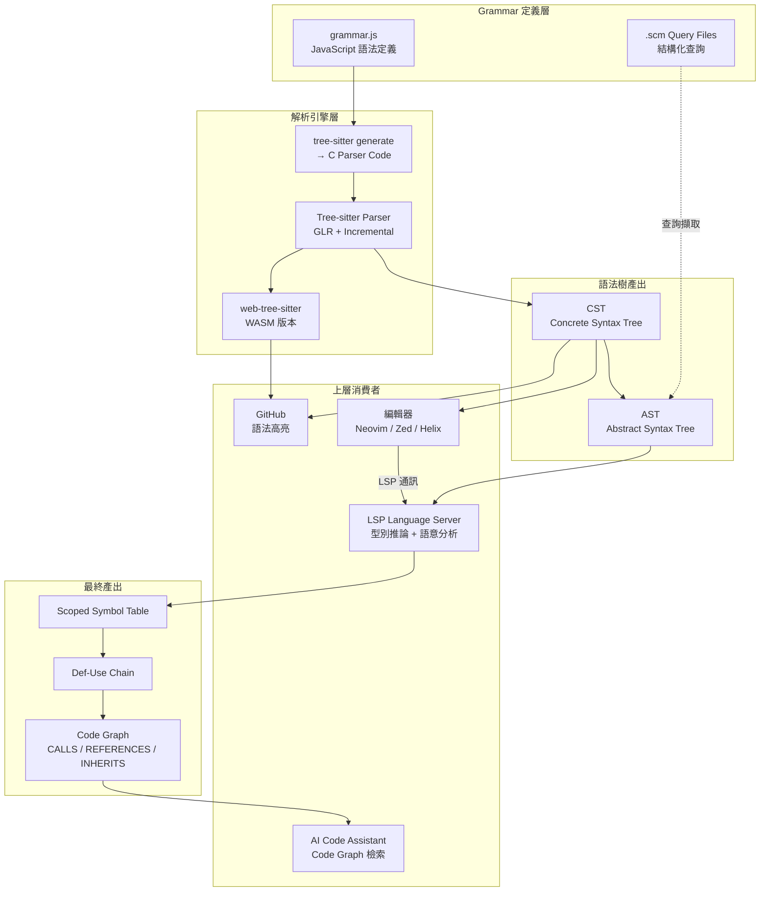

# 🗺️ Tree-sitter 種子地圖

> **類型：** 種子地圖
> **關聯：** [[Tree-sitter — 高效能增量 Parser]]

---

## 這張圖在描述什麼

Tree-sitter 的核心概念結構：從 Grammar 定義到最終的 Code Graph 產出，以及它與 LSP、編輯器、AI Assistant 的關係。

## 結構解讀

### 關鍵節點

| 節點 | 意義 | 重要度 |
|------|------|--------|
| Tree-sitter Parser | 核心引擎，GLR + 增量解析 | ⭐⭐⭐ |
| CST | 保留完整語法資訊的語法樹，可逆、可增量 | ⭐⭐⭐ |
| LSP Language Server | 語意分析的上層消費者 | ⭐⭐ |
| Code Graph | 最終的跨模組關係圖譜 | ⭐⭐ |
| grammar.js | Grammar-as-Code 設計，降低社群維護門檻 | ⭐ |

### 關鍵關係

| 關係 | 說明 |
|------|------|
| Parser → CST | Tree-sitter 直接產出 CST，不是 AST |
| CST → LSP | LSP 拿 CST 做語意分析的起點 |
| LSP → Code Graph | Code Graph 是 LSP 語意分析的最終產出 |
| WASM → GitHub | GitHub 用 WASM 版本做瀏覽器端語法高亮 |
| .scm → AST | Query Language 從 AST 擷取結構化模式 |

## 我的觀察

這張圖揭示了一個清晰的 **分層架構**：
- **語法層**（Tree-sitter）：只管解析，不管語意
- **語意層**（LSP）：加上型別、作用域、引用解析
- **圖譜層**（Code Graph）：跨模組的關係網路
- **應用層**（AI Assistant）：消費 Code Graph 做智慧檢索

目前的空缺：Tree-sitter 到 Code Graph 之間的 **自動化 pipeline** 還沒有成熟的開源實作。大多數工具只做到 LSP 層，Code Graph 還需要手工建構。

## 下一步

- [ ] 補充 Tree-sitter 與特定 Language Server 的整合方式
- [ ] 建立 Code Graph 自動化 pipeline prototype

## 連結

- 原始種子：[[Tree-sitter — 高效能增量 Parser]]
