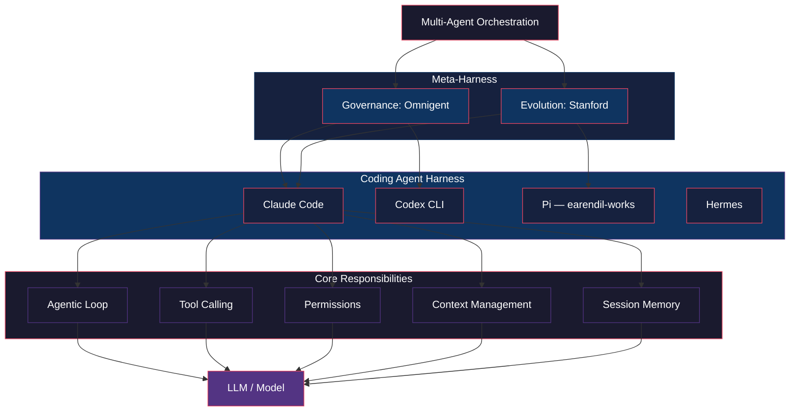

# 🗺️ Harness 視覺地圖

> 展示 Harness 種子內部的概念結構：核心定義、內部職責、三層分類與具體實例。

## 結構解讀

- **底部 LLM** 是被驅動的對象，不是 harness 本身
- **Coding Agent Harness** 是概念根（本頁面定義的層次）
- **Meta-Harness** 有兩種同名異義：治理/組合型 vs 自動演化/優化型
- **Multi-Agent Orchestration** 是多個 harness 協同工作的上層
- 箭頭方向：`-->` 表示「.builds on / 是其基礎」

## Mermaid

## 連結

- 種子頁面：[[wiki/concepts/harness]]
- 關聯種子：[[wiki/entities/omnigent]]、[[wiki/entities/claude-code]]、[[wiki/entities/github-copilot]]
- 關聯專題：[[wiki/topics/meta-systems]]、[[wiki/topics/ai-agent]]
