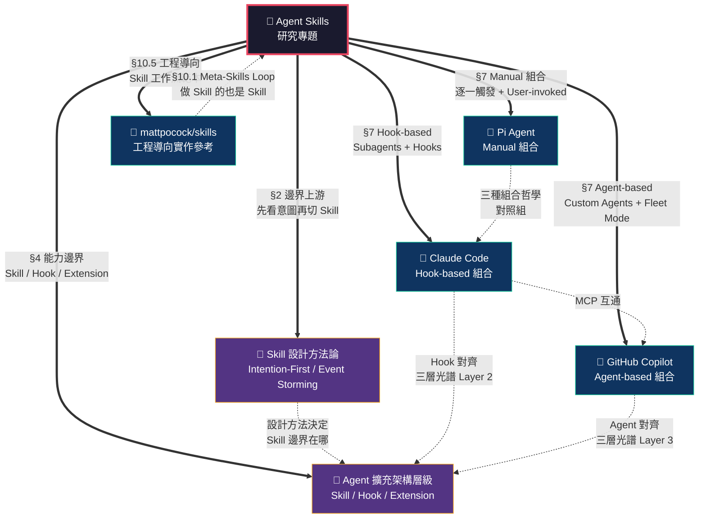

# 🔬 Agent Skills 研究專題 — 視覺地圖

> 本頁為 Notion 專題子頁面，展示「🔬 Agent Skills 研究專題」與其關聯種子的全景關係。
> 圖表已通過 `mermaid-cli (mmdc)` 實測渲染，SVG 檔案：`skill-topic-visualmap-new.svg`
> 本版已修正 Gemini + Codex 交叉評審抓到的章節引用錯誤，並新增 Pi Agent 節點還原「Manual 組合」哲學。

---

## 視覺地圖



---

### 圖例

| 色彩 | 範疇 | 說明 |
|------|------|------|
| 🔴 深底 + 紅框 | **研究專題本體** | 中心節點，13 章內容的統整入口 |
| 🔵 深藍 + 綠框 | **框架/實作種子**（🌿） | 三大主流 Agent 框架的組合哲學 + 一個社群工程實作參考 |
| 🟣 深紫 + 橘框 | **方法論種子**（🌱） | 設計思維與架構邊界的上游知識 |
| **粗箭頭** `==>` | **專題 → 種子** | 專題章節如何引用或對應每顆種子 |
| **虛線箭頭** `-.->` | **種子 ↔ 種子** | 種子之間的跨領域關聯 |

### 節點說明

| 節點 | 種子頁面 | 專題對應章節 | 核心角色 |
|------|---------|-------------|---------|
| 🔬 Agent Skills 研究專題 | — | 全文（§1–§13） | 統整 13 章的完整研究入口 |
| 🌿 Claude Code | Claude Code（Hook-based 組合） | §7.1–§7.2、§7.5 | Hook-based 組合哲學：Subagents + Hooks 三層架構 |
| 🌿 GitHub Copilot | GitHub Copilot（Agent-based 組合） | §7.1、§7.3、§7.3-2、§7.6 | Agent-based 組合哲學：Custom Agents + Fleet Mode + Steering |
| 🌿 Pi Agent | （本專案核心 agent，尚無獨立種子頁） | §7.4、§11 | Manual 組合哲學：User-invoked、逐一手動觸發、可觀測可干預 |
| 🌿 mattpocock/skills | mattpocock/skills（工程導向實作） | §10.5 | 社群 Skill 集合的工程實踐參考：`grill → spec → tickets → implement → review` |
| 🌱 Skill 設計方法論 | Skill 設計方法論（Intention-First / Event Storming / 決策樹） | §2 | 邊界的上游——先看意圖，再切 Skill |
| 🌱 Agent 擴充架構層級 | Agent 擴充架構層級（Skill / Hook / Extension 三層邊界） | §4 | 行為閘門——Skill 不夠時的下一層 |

### 關鍵關係說明

| 關係 | 類型 | 說明 |
|------|------|------|
| 專題 → Claude Code | 粗箭頭 | §7 剖析 Hook-based 組合：Subagents 獨立 context、Hooks 三層架構（Event/Matcher/Handler） |
| 專題 → GitHub Copilot | 粗箭頭 | §7 剖析 Agent-based 組合：Custom Agents scoped tools、Fleet Mode 並行 orchestration |
| 專題 → Pi Agent | 粗箭頭 | §7.4、§11 Manual 組合：無自動委派，人類手動串接多支 Skill，換取可觀測性與可干預性 |
| 專題 → mattpocock/skills | 粗箭頭 | §10.5 記錄工程導向 Skill 範本的核心工作流 `grill → spec → tickets → implement → review` |
| 專題 → 設計方法論 | 粗箭頭 | §2 五步驟方法論：Intention-First → Event Storming → Domain Know-how → 決策樹 → 交辦包 |
| 專題 → 擴充架構層級 | 粗箭頭 | §4 三層光譜：Skill（宣告式）→ Hook（事件驅動）→ Extension（平台能力）+ LLM 四大認知失敗對應四道閘門 |
| 設計方法論 → 擴充架構層級 | 虛線 | 方法論決定 Skill 的邊界，邊界不夠時向 Hook/Extension 升級 |
| Claude Code → Copilot | 虛線 | 兩大框架共享 MCP 標準，但組合哲學截然不同（開放生態 vs 程式化平台） |
| Claude Code → 擴充架構 | 虛線 | Hook 對應三層光譜 Layer 2（事件驅動強制） |
| Copilot → 擴充架構 | 虛線 | Agent 對應三層光譜 Layer 3（平台能力延伸），Custom Agents + Fleet Mode 是最深的平台整合 |
| Pi Agent → Claude Code | 虛線 | 三種組合哲學互為對照組：Manual（Pi）vs Hook-based（Claude）vs Agent-based（Copilot），是「定位」差異不是「好壞」差異 |
| mattpocock → 專題 | 虛線（回指） | §10.1 Meta-Skills Loop：做 Skill 的過程本身也是一支 Skill（`grill-me` → `skill-creator` 迴圈），mattpocock 的工作流是這個迴圈的具體案例 |

---

## 修訂紀錄

**v2（本版）**：依 Gemini + Codex 交叉評審結果修正：
- 修正「Skill 設計方法論」章節引用：§3 → §2（Intention-First/Event Storming/決策樹實際在第二章）
- 修正「mattpocock/skills」章節引用：§11.4（不存在）→ §10.5
- 新增「Pi Agent」節點，還原舊地圖「Manual 組合／逐一觸發」哲學（原本被誤放在 mattpocock/skills 節點上，混淆了「框架組合哲學」與「社群 Skill 實作參考」兩件事）
- mattpocock/skills 節點說明改為「工程導向實作參考」，不再兼任 Manual 組合代表

## mmdc 渲染驗證

```bash
# 指令
cd Obsidian/work/drafts && npx -y @mermaid-js/mermaid-cli mmdc -i skill-topic-visualmap-new.mmd -o skill-topic-visualmap-new.svg -b transparent

# 結果：Generating single mermaid chart（無錯誤，exit code 0）
# ✅ 產生 skill-topic-visualmap-new.svg（20,354 bytes，7 個節點 + 12 條邊線）
```

- **驗證方式**：由 Claude 直接執行 mmdc 指令驗證（非 agent 自報）
- **SVG 尺寸**：7 個節點 + 12 條邊線，成功渲染
